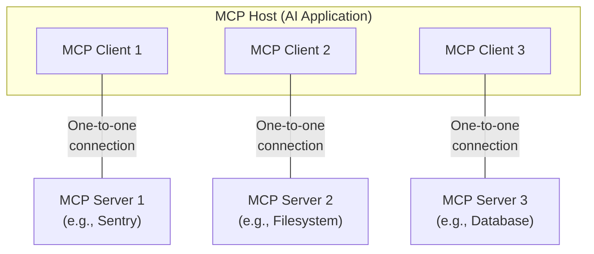
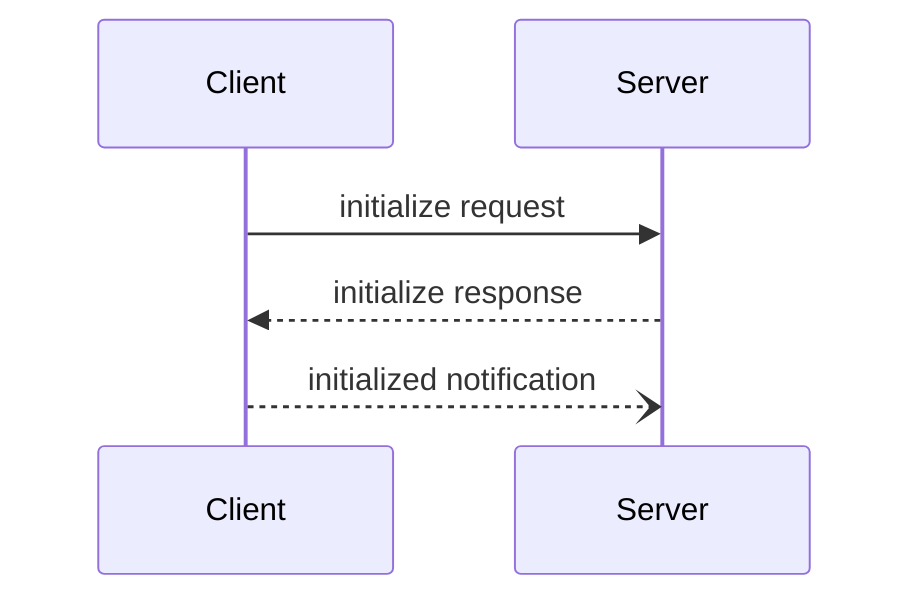

# MCP (Model Context Protocol) 개념 정리

## 📌 MCP란 무엇인가?

**Model Context Protocol (MCP)**는 AI 애플리케이션이 외부 데이터 소스 및 도구와 안전하게 연결될 수 있도록 Anthropic이 개발한 **개방형 표준 프로토콜**입니다.

MCP는 AI 애플리케이션을 위한 **"USB-C 포트"**와 같은 역할을 합니다. USB-C가 다양한 디바이스를 표준화된 방식으로 연결하듯이, MCP는 AI 모델과 다양한 데이터 소스 및 도구를 표준화된 방식으로 연결합니다.

---

## 🎯 핵심 특징

### 1. **표준화된 연결 (Standardized Connection)**

- AI 모델과 데이터 소스 간 일관된 연결 방식 제공
- 각 데이터 소스마다 별도의 통합 코드를 작성할 필요 없음
- JSON-RPC 2.0 프로토콜 기반

### 2. **보안성 (Security)**

- 안전한 데이터 접근 및 권한 관리
- OAuth 2.1 및 PKCE 지원
- 최소 권한 원칙 적용

### 3. **확장성 (Scalability)**

- 필요에 따라 새로운 MCP 서버를 추가하여 기능 확장
- 다중 서버 동시 연결 지원
- 플러그인 방식의 아키텍처

### 4. **양방향 통신 (Bidirectional Communication)**

- AI가 데이터를 읽고 작업을 수행 가능
- 서버에서 클라이언트로 요청 가능
- 실시간 업데이트 및 알림 지원

---

## 🏗️ MCP 아키텍처

### 기본 구조



### 구성 요소

#### 1. **MCP Host (호스트)**

- AI 애플리케이션 (예: Claude Desktop, Claude Code)
- 여러 MCP 클라이언트를 관리
- 사용자 인터페이스 제공

#### 2. **MCP Client (클라이언트)**

- Host 내부에서 실행
- MCP 서버와 1:1 연결 유지
- 프로토콜 통신 처리

#### 3. **MCP Server (서버)**

- 특정 데이터 소스나 도구에 대한 접근 제공
- Resources, Tools, Prompts 노출
- 독립적으로 실행되는 프로세스

---

## 🔄 MCP 통신 프로토콜

MCP는 **JSON-RPC 2.0** 프로토콜을 사용합니다.

### 메시지 유형

#### 1. **Request (요청)**

```json
{
  "jsonrpc": "2.0",
  "id": 1,
  "method": "tools/list",
  "params": {}
}
```

#### 2. **Response (응답)**

```json
{
  "jsonrpc": "2.0",
  "id": 1,
  "result": {
    "tools": [...]
  }
}
```

#### 3. **Notification (알림)**

```json
{
  "jsonrpc": "2.0",
  "method": "notifications/tools/list_changed"
}
```

---

## 📦 MCP의 핵심 개념

### 1. Resources (리소스)

**정의**: 서버가 노출하는 데이터 소스

**특징**:
- 파일, 데이터베이스 레코드, API 응답 등
- URI로 식별 (예: `file:///path/to/file.txt`)
- 읽기 전용 또는 읽기/쓰기 가능

**예시**:

```json
{
  "uri": "file:///project/README.md",
  "name": "README.md",
  "mimeType": "text/markdown"
}
```

### 2. Tools (도구)

**정의**: 서버가 제공하는 실행 가능한 기능

**특징**:
- AI가 호출할 수 있는 함수/명령
- 입력 스키마 정의 필요
- 실행 결과 반환

**예시**:

```json
{
  "name": "get_weather",
  "description": "Get current weather for a location",
  "inputSchema": {
    "type": "object",
    "properties": {
      "location": {
        "type": "string"
      }
    }
  }
}
```

### 3. Prompts (프롬프트)

**정의**: 재사용 가능한 프롬프트 템플릿

**특징**:
- 사전 정의된 프롬프트
- 매개변수 지원
- 컨텍스트 포함 가능

**예시**:

```json
{
  "name": "code_review",
  "description": "Review code for quality and best practices",
  "arguments": [
    {
      "name": "code",
      "description": "Code to review"
    }
  ]
}
```

---

## 🔌 MCP 생명주기 (Lifecycle)

### 1. 초기화 (Initialization)



**단계**:
1. Client가 Server에 `initialize` 요청
2. Server가 지원 기능(capabilities) 응답
3. Client가 `initialized` 알림 전송

### 2. 운영 (Operation)

**주요 작업**:
- Tool 목록 조회: `tools/list`
- Tool 실행: `tools/call`
- Resource 목록 조회: `resources/list`
- Resource 읽기: `resources/read`
- Prompt 가져오기: `prompts/get`

### 3. 종료 (Shutdown)

- Client가 연결 종료
- Server 프로세스 정리

---

## 🌟 MCP의 주요 기능

### 1. **도구 발견 (Tool Discovery)**

AI 애플리케이션이 사용 가능한 도구를 동적으로 발견합니다.

```python
# Pseudo-code
available_tools = []
for session in app.mcp_server_sessions():
    tools_response = await session.list_tools()
    available_tools.extend(tools_response.tools)
```

### 2. **실시간 업데이트 (Real-time Updates)**

서버가 변경사항을 클라이언트에 알립니다.

```json
{
  "jsonrpc": "2.0",
  "method": "notifications/tools/list_changed"
}
```

### 3. **샘플링 요청 (Sampling)**

서버가 클라이언트의 LLM에 완성 요청을 보낼 수 있습니다.

```json
{
  "method": "sampling/createMessage",
  "params": {
    "messages": [
      {
        "role": "user",
        "content": "Your prompt here"
      }
    ],
    "maxTokens": 100
  }
}
```

### 4. **사용자 입력 요청 (Elicitation)**

서버가 사용자로부터 추가 정보를 요청할 수 있습니다.

```json
{
  "method": "elicitation/request",
  "params": {
    "question": "Are you sure you want to proceed?"
  }
}
```

---

## 🔐 보안 및 인증

### OAuth 2.1 지원

MCP는 OAuth 2.1 표준을 따릅니다:

- **PKCE (Proof Key for Code Exchange)** 필수
- **동적 클라이언트 등록 (RFC 7591)** 지원
- **서버 메타데이터 발견 (RFC 8414)** 지원

### 권한 관리

- 최소 권한 원칙 적용
- Scope 기반 접근 제어
- 토큰 기반 인증

---

## 💡 MCP 사용 사례

### 1. **개발 워크플로우**

- GitHub 이슈 및 PR 관리
- 코드 리뷰 자동화
- 빌드 및 배포 자동화

### 2. **데이터 분석**

- 데이터베이스 쿼리
- 로그 분석
- 메트릭 수집 및 시각화

### 3. **문서 관리**

- 파일 시스템 탐색
- 문서 검색 및 요약
- 지식 베이스 구축

### 4. **팀 협업**

- Slack 메시지 분석
- 회의록 작성
- 작업 추적 및 보고

---

## 🚀 MCP vs 기존 통합 방식

| 측면 | 기존 방식 | MCP |
|------|----------|-----|
| **통합 복잡도** | 각 데이터 소스마다 별도 코드 | 표준화된 프로토콜 |
| **보안** | 각자 다른 인증 방식 | OAuth 2.1 표준 |
| **확장성** | 새로운 통합마다 개발 필요 | 플러그인 방식 |
| **유지보수** | 각 통합 개별 관리 | 중앙 집중식 관리 |
| **재사용성** | 낮음 | 높음 (공통 서버 사용) |

---

## 📚 MCP 프로토콜 버전

- **현재 버전**: `2025-06-18`
- **프로토콜 진화**: 하위 호환성 유지
- **버전 협상**: 초기화 시 클라이언트-서버 간 버전 합의

---

## 🔗 관련 표준 및 기술

### 기반 프로토콜

- **JSON-RPC 2.0**: 메시지 교환
- **JSON Schema**: 데이터 검증
- **OAuth 2.1**: 인증 및 권한 부여

### 전송 계층

- **stdio**: 표준 입출력
- **HTTP + SSE**: 웹 기반 통신
- **WebSocket**: 양방향 실시간 통신 (향후 지원 예정)

---

## 🎓 학습 리소스

### 공식 문서

- **MCP 공식 사이트**: https://modelcontextprotocol.io
- **GitHub 저장소**: https://github.com/modelcontextprotocol
- **명세 문서**: https://modelcontextprotocol.io/specification

### 초보자 가이드

- **Microsoft MCP for Beginners**: https://github.com/microsoft/mcp-for-beginners
- 다양한 언어로 제공 (C#, Java, JavaScript, Python, TypeScript)
- 실전 예제 포함

### SDK 및 도구

- **Python SDK**: `@modelcontextprotocol/python-sdk`
- **TypeScript SDK**: `@modelcontextprotocol/typescript-sdk`
- **C# SDK**: MCP.NET
- **Java SDK**: modelcontextprotocol/java-sdk

---

## 💭 MCP의 장점

### 개발자 관점

✅ 표준화된 API로 학습 곡선 감소  
✅ 재사용 가능한 서버 컴포넌트  
✅ 빠른 프로토타이핑 가능  
✅ 오픈소스 생태계 활용

### 사용자 관점

✅ 더 강력한 AI 기능  
✅ 개인 데이터와 안전하게 통합  
✅ 커스터마이징 가능한 워크플로우  
✅ 다양한 도구 통합

### 조직 관점

✅ 보안 및 규정 준수  
✅ 중앙 집중식 관리  
✅ 확장 가능한 아키텍처  
✅ 비용 효율적인 통합

---

## 📝 요약

**MCP (Model Context Protocol)**는:

1. **표준화된 프로토콜**: AI와 데이터 소스를 연결하는 공통 규격
2. **오픈 소스**: 누구나 구현하고 확장 가능
3. **보안**: OAuth 2.1 기반의 안전한 통합
4. **확장 가능**: 플러그인 방식으로 기능 추가
5. **커뮤니티 주도**: 활발한 오픈소스 생태계

MCP를 사용하면 AI 애플리케이션을 다양한 데이터 소스 및 도구와 쉽게 통합하여 더 강력하고 유용한 AI 경험을 만들 수 있습니다.

---

**작성일**: 2025년 10월 11일  
**버전**: 1.0  
**출처**: [Model Context Protocol 공식 문서](https://modelcontextprotocol.io)
